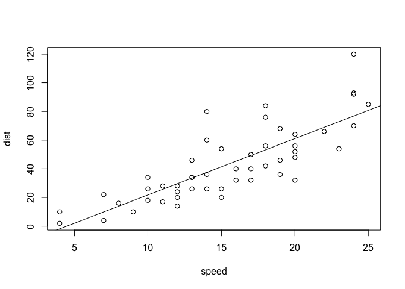

This is a text paragraph in an R Markdown document.

Below is working R code in a code chunk:

    fit = lm(dist ~ speed, data = cars)
    b   = coef(fit)
    plot(cars)
    abline(fit)

There are two parameters in a regression: b\[1\] = -17.5790949 and
b\[2\] = 3.9324088. Which one is the slope and which is the intercept?
